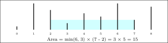

# MaxWaterContainer

## The Problem

You're given an array of non-negative integers, where each element represents the height of a vertical line at that
index.

Your task is to complete the two methods on the `MaxWaterContainer` class. You need to choose two lines such that,
together with the x-axis, they form a container that holds the most water.

Note that, when forming our container, we ignore all barriers between the left wall and the right wall.

Return the **maximum possible area** you can form by choosing any two lines.

## Brute Force Solution: `MaxWaterContainer.mostWaterBruteForce`

This approach checks all possible pairs of lines `(i, j)` using two nested loops. For each pair, it computes the area
using the formula: `min(heights[i], heights[j]) * (j - i)`, and then tracks the maximum area found.

### Basic Steps

* Initialise a variable `maxArea`.
* Start an outer loop with pointer `i` from the first element to the second-to-last element of the `heights` array.
* Inside the outer loop, start an inner loop with pointer `j` from `i + 1` to the last element of the `heights` array.
* Calculate the `width` of the container as `j - i`.
* Determine the `currentHeight` of the container as the minimum of `heights[i]` and `heights[j]`.
* Calculate the `currentArea` as `width * currentHeight`.
* If `currentArea` is greater than `maxArea`, update `maxArea`.
* After both loops complete, return `maxArea`.

### Complexity

* **Time complexity**: O(n²) - Due to the two nested loops, checking every possible pair.
* **Space complexity**: O(1) - Only a few variables are used.

---

## Two-Pointer Solution: `MaxWaterContainer.mostWaterTwoPointers`

This optimised approach uses two pointers, `left` and `right`, starting at the two ends of the array. At each step, it
calculates the area and then strategically moves the pointer associated with the shorter line inward. This works because
moving the taller line inward cannot increase the height of the container (which is limited by the shorter line), but
moving the shorter line inward *might* find a taller line, potentially leading to a larger area.

### Basic Steps

* Initialise a `left` pointer to the first index and a `right` pointer to the last index.
* Initialise a variable `maxArea`.
* While the `left` pointer is less than the `right` pointer:
    * Calculate the `width` of the container as `right - left`.
    * Determine the `minHeight` of the two current lines as the minimum of `heights[left]` and `heights[right]`.
    * Calculate the `currentArea` as `width * minHeight`.
    * Update `maxArea` if `currentArea` is greater than `maxArea`.
    * If `heights[left]` is less than `heights[right]`, increment the `left` pointer by one.
    * Otherwise (if `heights[right]` is less than or equal to `heights[left]`), decrement the `right` pointer by one.
* Return `maxArea`.

### Complexity

* **Time complexity**: O(n) - The pointers traverse the array only once.
* **Space complexity**: O(1) - Only a few variables are used.